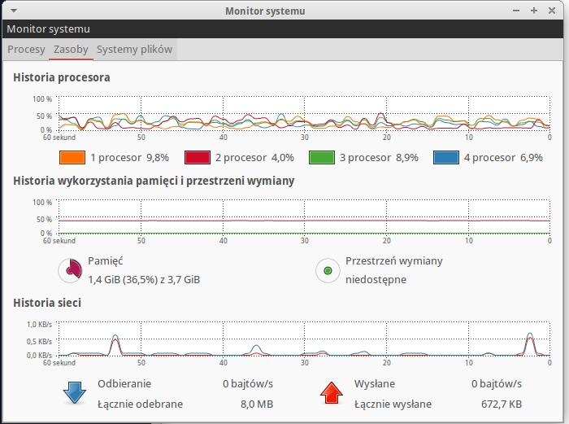

# *Kacper Czechowicz*

* [Dane techniczne](#dane-techniczne)
* [Zadanie 1a](#zadanie-1a)
* [Zadanie 1b](#zadanie-1b)
* [Zadanie 1c](#zadanie-1c)
* [Zadanie 1d](#zadanie-1d)

## Dane Techniczne

Procesor:
	Intel Core I5 3470 3.2Ghz

RAM:
	Kingston HyperX 4GB 1600MHz DDR3 CL9

Dysk Twardy:
	Seagate 500GB Barracuda 7200x

System operacyjny:
	Xubuntu 14.04

Baza Danych:
	MongoDB 2.6.5, Postgres 9.3

## Zadanie 1a

### Import danych do MongoDB:

Wykorzystanie systemu podczas importu:

Czas importu danych:

### Import danych do PostgreSQL

Wykorzystanie systemu podczas importu:

Czas importu danych:
