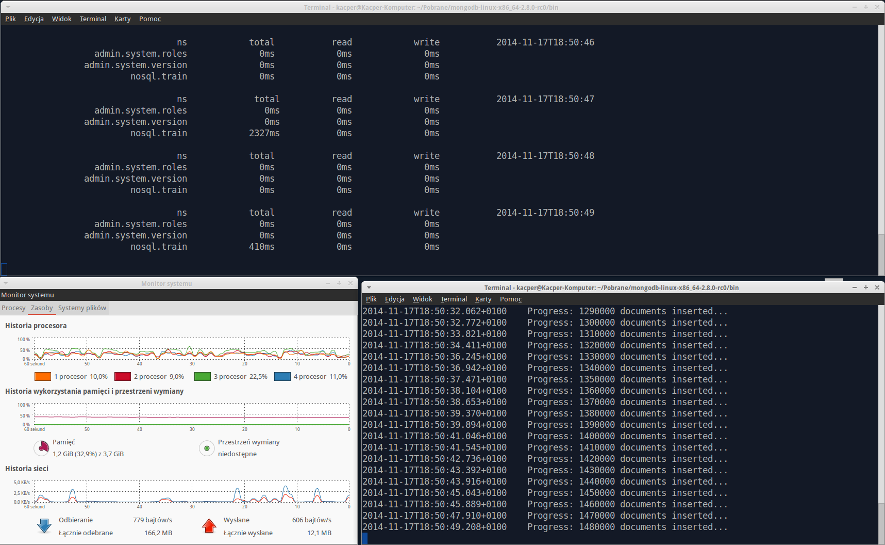
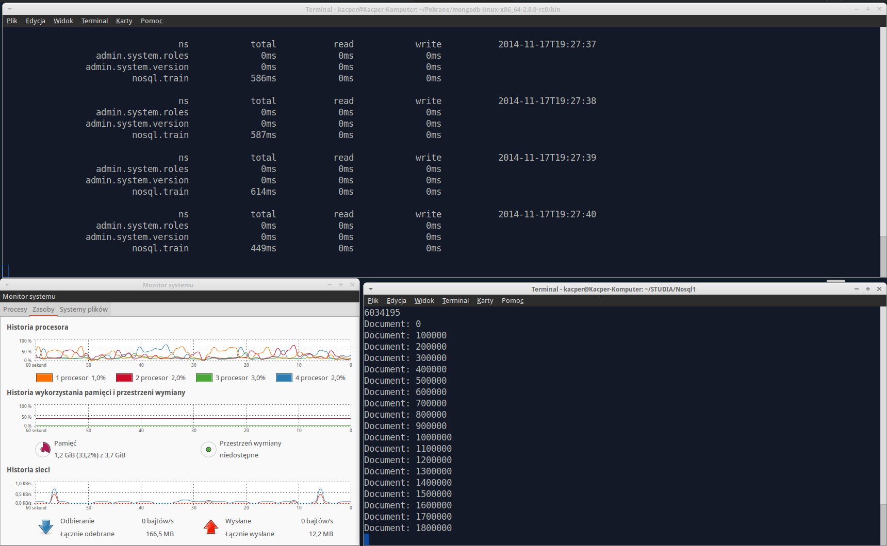
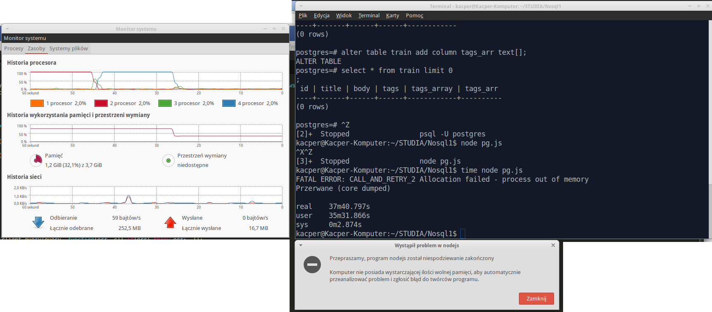

# *Kacper Czechowicz*

* [Dane techniczne](#dane-techniczne)
* [Zadanie 1a](#zadanie-1a)
* [Zadanie 1b](#zadanie-1b)
* [Zadanie 1c](#zadanie-1c)
* [Zadanie 1d](#zadanie-1d)

## Dane Techniczne

Procesor:
	Intel Core I5 3470 3.2Ghz

RAM:
	Kingston HyperX 4GB 1600MHz DDR3 CL9

Dysk Twardy:
	Seagate 500GB Barracuda 7200x

System operacyjny:
	Xubuntu 14.04

Baza Danych:
	MongoDB 2.6.5, MongoDB 2.8.0-rc0, Postgres 9.3


## Zadanie 1a

### Import danych do MongoDB:

#### Mongo 2.6.5

Import i czas:

```sh
time mongoimport --db nosql --collection train --type csv --headerline --file Train.csv
...

real    6m40.038s
user    1m0.003s
sys     0m6.500s
```

Wykorzystanie systemu podczas importu:


#### Mongo 2.8.0-rc0

```sh
time mongoimport --db nosql --collection train --type csv --headerline --file Train.csv
...

real    8m17.160s
user    5m13.134s
sys     0m32.395s
```
Wykorzystanie systemu i bazy mongo podczas importu:



### Import danych do PostgreSQL

Import i czas:

```sh
time psql -d postgres -c "copy train(Id, Title,Body,Tags) from '/home/Kacper/Train.csv' with delimiter ',' csv header" -U postgres
COPY 6034195

real    19m36.262s
user    0m0.019s
sys     0m0.034s
```

Wykorzystanie systemu podczas importu:


## Zadanie 1b

### Zliczanie danych w MongoDB

Funkcja zliczająca w MongoDB wyświetla wynik niemal natychmiastowo, a baza zawierająca dane waży ok 16GB ( w wersji 2.6.5 i 2.8.0-rc0 wygląda to identycznie )

```sh
> show dbs
local 0.078GB
nosql 15.946GB
> db.train.count()
6034195
```
### Zliczanie danych w PostgreSQL

W psql zliczanie danych jest nieco bardziej czasochłonne:

```sh
time psql -c "select count(*) from train" -U postgres
  count
----------
 6034195
 (1 row)

real    2m57.268s
user    0m0.034s
sys     0m0.015s
```

## Zadanie 1c

Program wykorzystany w tym zadaniu napisałem w javascript oraz uruchomiłem go za pomocą node.js. Sterownik jaki wykorzystałem to node-mongodb-nativ. Skrypt znajduje się tu: [skrypt](/scripts/index.js)

#### Mongo 2.6.5

Wykorzystanie zasobów podczas działania programu: 


Wynik działania programu:

```sh
time node index.js
...
Wszystkie tagi: 17129359
Tagi unikalne: 42003

real    25m43.432s
user    20m19.106s
sys     0m37.353s
```
#### Mongo 2.8.0-rc0

Wykorzystanie zasobów podczas działania programu: 



Wynik działania programu:

```sh
time node index.js
...
Wszystkie tagi: 17129359
Tagi unikalne: 42003

real    44m52.455s
user    20m30.757s
sys     0m35.070s
```
Oprócz zliczenia tagów, wynikiem programu jest zamiana ciągu znaków w polu 'Tags' na tablice z tagami w bazie MongoDB:
```javascript
{ Tags: "c# javascript" };
//na
{ Tags: ["c#", "javascript"] };
```

#### Psql

Mimo szczerych chęci wykonanie skryptu w node na danych urzytych w tym zadaniu w bazie postgres, było niemożliwe, ponieważ sterownik postgresa próbuje załadować całą tabele do pamięci podręcznej.


Skrypt: [pg.js](scripts/pg.js)


## Zadanie 1d

Dane wykorzystane w zadaniu zostały pobrane z [koordinates.com](http://koordinates.com)

Pobrałem dane:
	
	- Poligony miast w Colorado USA
	- Punkty lotniska w Colorado USA
	- Linie torowisk w Colorado USA


#### Zapytanie nr 1

Miasta w Colorado w obrębie 100km od lotniska Stevens Field:
```javascript
var stevensField = {"type": "Point", "coordinates": [ -107.055870003997498, 37.277499999018417 ] };
db.colorado.find({"geometry" : {$near: { $geometry: stevensField, $maxDistance: 100000 }}, "type": "City"});
```
Wynik zapytania: [zapytanie1](geojson/stevensField.geojson)

#### Zapytanie nr 2

Linie kolejowe przeprowadzone przez miasto Bethune w Colorado
```javascript
var bethune = { "type": "Polygon", "coordinates":[[ [ -102.418688034668037, 39.301254315004115 ], [ -102.428046887127223, 39.301218339629962 ], [ -102.427941487619066, 39.305837656221655 ], [ -102.418290884060283, 39.305907701415613 ], [ -102.418707328423338, 39.302741247640967 ], [ -102.418688034668037, 39.301254315004115 ] ] ] };
db.colorado.find({"geometry" : {$geoWithin: {$geometry: bethune}}, "type": "Railroad"}, {"_id": 0});

```
Wynik zapytania: [zapytanie2](geojson/bethune.geojson)

#### Zapytanie nr 3

Miasta przez które przejeżdza linia kolejowa D and R G Western Railroad
```javascript
var westernRailroad = { "type": "LineString", "coordinates": [ [ -104.857137759074348, 39.371631748015531 ], [ -104.857594758539094, 39.372285751524416 ], [ -104.857614758053813, 39.372424749167649 ], [ -104.857774756845799, 39.373496749277663 ], [ -104.857821764243084, 39.373811751231258 ], [ -104.857516761835285, 39.374486753522895 ] ] };
db.colorado.find({"geometry" : {$geoIntersects: {$geometry: westernRailroad}}, "type": "City"}, {"_id": 0})
```
Wynik zapytania: [zapytanie3](geojson/western.geojson)

#### Zapytanie nr 4

Torowiska na trasie samolotu ze Stevens Field do Telluride Regional Airport
```javascript
var airLine = {"type": "LineString", "coordinates": [ [ -107.908480003690741, 37.953760001039718 ], [ -107.055870003997498, 37.277499999018417 ] ] };
db.colorado.find({"geometry" : {$geoIntersects: { $geometry: airLine }}, "type": "Railroad"}, {"_id": 0});
```
Wynik zapytania: [zapytanie4](geojson/airline.geojson)

#### Zapytanie nr 5

Miasta i lotniska między Las Animas City and County Airport, Stevens Field oraz Telluride Regional Airport
```javascript
var airs = {"type": "Polygon", "coordinates": [ [ [ -107.908480003690741, 37.953760001039718 ], [ -107.055870003997498, 37.277499999018417 ], [ -103.23714999578533, 38.052780003818988 ], [ -107.908480003690741, 37.953760001039718 ] ] ] };
db.colorado.find({"geometry" : {$geoWithin: {$geometry: airs}}, "type": /City|Airport/ }, {"_id": 0});
```
Wynik zapytania: [zapytanie5](geojson/cityandairport.geojson)

#### Zapytanie nr 6

Linie kolejowe w odległości minimum 10km od Lake Country Airport
```javascript
var lakeCntryAir = { "type": "Point", "coordinates": [ -106.316689997707329, 39.220270003429214 ] };
db.colorado.find({"geometry" : {$near: { $geometry: lakeCntryAir, $minDistance: 10000}}, "type": "Railroad"}, {"_id": 0});
```
Wynik zapytania: [zapytanie6](geojson/lakecntry.geojson)

#### Zapytanie nr 7

Lotniska w promieniu 2 jednostek od lotniska Kit Carson County Airport
```javascript
db.colorado.find({"geometry" : { $geoWithin: { $center: [[ -102.285390004028798, 39.242499999373614 ],2]} }, "type": "Airport" });
```

Wynik zapytania: [zapytanie7](geojson/kitCarson.geojson)